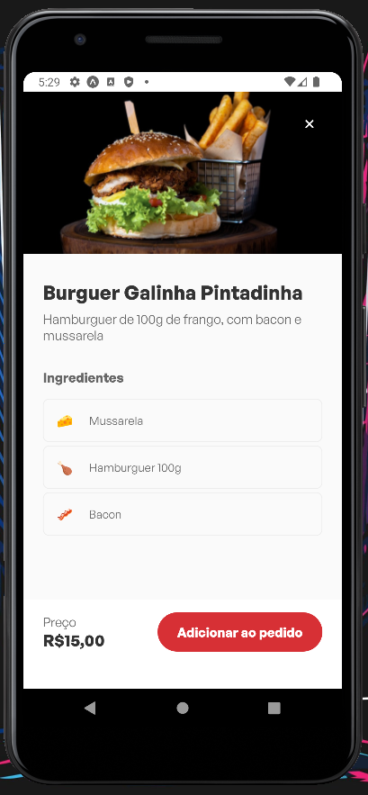

<p align="center">  GAR.COM APP 🚀</p>

<p align="center">
   
</p>

<p align="center">
   <a href="https://www.linkedin.com/in/lorison-gilles/">
      
   </a>
  

  <a href="https://github.com/Gilles30/gar.com-app/commits/master">
    
  </a>
  
  <a href="https://github.com/Gilles30/gar.com-app/stargazers">
    
  </a>
</p>

> <p align="center"> :rocket: Project created to practice my knowledge. </p>

<p align="center">
    <a href="README.md">English</a>
    ·
    <a href="README-pt.md">Portuguese</a>
 </p>

<div align="center">
  <sub>The GAR.COM APP. Built with ❤︎ by
    <a href="https://github.com/Gilles30">Lorison Gilles</a> and
    <a href="https://github.com/Gilles30/gar.com-app/">
      contributors
    </a>
  </sub>
</div>

# :pushpin: Table of Contents

- [:pushpin: Table of Contents](#pushpin-table-of-contents)
    - [Mobile Screenshot](#mobile-screenshot)
- [:computer: Technologies](#computer-technologies)
- [:rocket: Features](#rocket-features)
- [:rocket: Figma Style Guide](#rocket-figma-style-guide)
- [:construction\_worker: How to run](#construction_worker-how-to-run)
    - [📦 Run API](#-run-api)
    - [💻 Run Project](#-run-project)
- [:bug: Issues](#bug-issues)
- [:tada: Contributing](#tada-contributing)
  - [🤝 Contributing](#-contributing)
- [:closed\_book: License](#closed_book-license)

</p>

</br></br>

### Mobile Screenshot

</br>

<div align="center">
   
   <p>
    An app to help waiters serve tables faster and with a lower rate of failures.
   </p>
   </br></br>
   
   </br></br>
   <p>
    Mobile app with an intuitive interface and usability.
   </p>
   </br></br>
   
   <p>
    Horizontal listing with flatList with selection on and off.
   </p>
   </br></br>
   
   <p>
    Clicking on a new order or on the add item button opens the modal with asset validation.
   </p>
   </br></br>
   
   <p>
    By clicking on the input the modal is activated, being able to put the table number to start the order.
   </p>
   </br></br>
   
   <p>
    Clicking on the item we can see the details of the chosen product.
   </p>
   </br></br>
   
   <p>
    During the request we have this interface.
   </p>
   </br></br>
   
   <p>
    When you click confirm order we have the completion screen.
   </p>

</div>
</br>

# :computer: Technologies

This project was made using the follow technologies:

- [Typescript](https://www.typescriptlang.org/)
- [Expo](https://expo.dev/)
- [Axios](https://axios-http.com/)
- [Prettier](https://prettier.io/)
- [React-Native](https://reactnative.dev/)
- [Styled-Components](https://www.styled-components.com/)
- [React-Native-Vector-Icons](https://github.com/oblador/react-native-vector-icons)
- [Babel](https://babeljs.io/)

# :rocket: Features

- Product listing.
- Item selection for cart.
- Make a wish.
- Submit Orders.
- Cancel orders.

# :rocket: Figma Style Guide

<div align="center">
  
  </br></br>
</div>
  https://www.figma.com/file/LIB0ZSzRpA9t4tBRw04NuH/GAR.COM?node-id=13%3A686&t=GiPRcVAVSa9SanPB-1

# :construction_worker: How to run

```bash
# Clone Repository
$ git clone https://github.com/Gilles30/
gar.com-app.git
```

### 📦 Run API

- API consumed directly from the cloud!

```bash
# Run Docker
$ Run Docker with the image created for the app/

# Clone the repository from the link below
$ https://github.com/Gilles30/foodreq-api

# Run the API
$ yarn dev

# Open Insomnia or Postman

# Start by creating the category in the URL and using the JSON format below
$ http://localhost:8080/categories

$ {
	"icon": "🥤",
	"name": "Bebidas"
  }

# Create the products using the link and JSON structure below - POST - Body - Multi Platform
$ http://localhost:8080/products

$ {
    "name": "Burguer Galinha Pintadinha",
    "description": "Hamburguer de 100g de frango, com bacon e mussarela",
    "imagePath": "1668712655163-chicken.png",
    "price": 15,
    "ingredients": [
      {
        "name": "Mussarela",
        "icon": "🧀",
        "_id": "637688cfad42cbe1501f9d9c"
      },
      {
        "name": "Hamburguer 100g",
        "icon": "🍗",
        "_id": "637688cfad42cbe1501f9d9d"
      },
      {
        "name": "Bacon",
        "icon": "🥓",
        "_id": "637688cfad42cbe1501f9d9e"
      }
    ],
    "category": "637681a3e6b224a1cbd57363",
    "_id": "637688cfad42cbe1501f9d9b",
    "__v": 0
  }

# For the image item, you must choose the File item and upload it by selecting it from your computer

# Inputs that are not shown in the image below but appear in the JSON are filled in automatically

# If you followed all the steps correctly you should get both listings.

```


Access docs API at mks-frontend-challenge-api.herokuapp.com/api-docs/

### 💻 Run Project

```bash

#Attention: Before starting, in some files, you must be on the localhost port that metro uses.

$ src\components\Cart\index.tsx

$ src\components\Menu\index.tsx

$ src\components\ProductModal\index.tsx

$ src\utils\api.ts

 Replace localhost with your IP used by metro

# Install Dependencies (Only if you haven't installed the dependencies before)
$ yarn

# Run Aplication
$ yarn start

#Remembering that all emulator or cell phone settings must already be ready before starting the project


```

# :bug: Issues

Feel free to **file a new issue** with a respective title and description on the the [Proffy](https://github.com/Gilles30/gar.com-app/issues) repository. If you already found a solution to your problem, **i would love to review your pull request**!

# :tada: Contributing

Check out the [contributing](./CONTRIBUTING.md) page to see the best places to file issues, start discussions and begin contributing.

## 🤝 Contributing

Follow the steps below to contribute:

1.  _fork_ the project (<https://github.com/Gilles30/gar.com-app>)

2.  Clone your _fork_ to your machine (`git clone https://github.com/Gilles30/gar.com-app.git`)

3.  Create a _branch_ to carry out your modification (`git checkout -b feature/name_new_feature`)

4.  Add your modifications and do the _commit_ (`git commit -m "Descreva sua modificação"`)

5.  _Push_ (`git push origin feature/name_new_feature`)

6.  Create a new _Pull Request_

7.  Okay, now just wait for the analysis 🚀

# :closed_book: License

Released in 2022 :closed_book: License

Made with love by [Lorison Gilles](https://github.com/Gilles30) 🚀.
This project is under the [MIT license](./LICENSE).

Give a ⭐️ if this project helped you!
